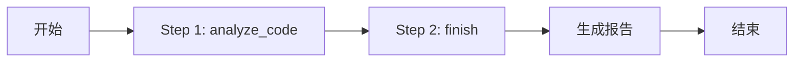

# 🤖 Code Reviewer Agent

一个基于 ReAct 框架的 Python 代码审查 Agent，能够自动检测代码质量问题并生成可视化报告。

## ✨ 特性

- 🔍 **自动代码审查**：检测函数长度、类型注解、异常处理、文档字符串等 4 个维度
- 🧠 **ReAct 框架**：实现 Thought → Action → Observation 循环
- 📊 **可视化报告**：自动生成 Markdown 报告 + Mermaid 流程图
- 🎯 **Few-shot 优化**：通过正反例提升工具使用准确率
- 📈 **执行统计**：记录工具调用次数、执行步数、成功率

## 🏗️ 架构设计

```
Agent 核心
├── LLM 大脑（DeepSeek API）
├── 工具系统（read_file, list_files, analyze_code）
└── ReAct 循环（推理 → 行动 → 观察）
```

## 📦 项目结构

```
CodeAgent/
├── real_agent.py          # Agent 核心实现（ReAct 框架）
├── code_reviewer.py       # 代码审查 Agent（领域专用）
├── visualizer.py          # 执行可视化工具
├── test_analyze.py        # analyze_code 工具测试
├── simple_agent.py        # 示例代码（用于测试）
├── .env                   # API Key 配置（不提交）
└── README.md              # 项目文档
```

## 🚀 快速开始

### 1. 环境要求

- Python 3.11+
- DeepSeek API Key

### 2. 安装依赖

```bash
pip install aiohttp python-dotenv
```

### 3. 配置 API Key

在项目根目录创建 `.env` 文件：

```env
DEEPSEEK_API_KEY=your_api_key_here
```

或设置环境变量：

```bash
# Windows
set DEEPSEEK_API_KEY=your_api_key_here

# Linux/Mac
export DEEPSEEK_API_KEY=your_api_key_here
```

### 4. 运行代码审查

```bash
python code_reviewer.py
```

**预期输出**：

```
======================================================================
🚀 代码审查 Agent - Day 4 项目实战
======================================================================

======================================================================
🔍 代码审查 Agent 启动
======================================================================
目标文件: simple_agent.py
======================================================================

🎯 任务: 审查 simple_agent.py 的代码质量...

Step 1: analyze_code → 发现 3 个问题
Step 2: finish → 生成审查报告

======================================================================
✅ 审查完成
======================================================================
📄 报告: review_simple_agent_report.md
======================================================================
```

### 5. 查看审查报告

用 VS Code 或 Markdown 查看器打开生成的报告：

```bash
code review_simple_agent_report.md
```

报告包含：
- 📋 审查结果（问题列表 + 行号定位）
- 📊 执行统计（步数、工具使用、成功率）
- 🎨 Mermaid 流程图（执行过程可视化）

## 🧪 测试单个工具

测试 `analyze_code` 工具：

```bash
python test_analyze.py
```

**输出示例**：

```json
{
  "file": "simple_agent.py",
  "total_issues": 3,
  "issues": [
    {
      "line": 41,
      "type": "函数过长",
      "severity": "warning",
      "detail": "函数 think 有 51 行(建议<50行)"
    },
    {
      "line": 107,
      "type": "缺少返回类型注解",
      "severity": "info",
      "detail": "函数 run 缺少返回类型注解(-> type)"
    }
  ]
}
```

## 🎓 核心技术

### 1. ReAct 框架

**Thought（思考）→ Action（行动）→ Observation（观察）**

```python
async def run(self, task: str, max_steps=10):
    while step < max_steps and not done:
        # 1. LLM 推理（思考下一步行动）
        response = await self.call_llm(messages)
        
        # 2. 解析并执行工具（行动）
        action = response["action"]
        result = TOOLS[action]["function"](**action_input)
        
        # 3. 记录结果（观察）
        history.append({"thought": ..., "action": ..., "observation": ...})
```

### 2. Tool Schema（工具描述）

让 LLM 知道有哪些工具、如何使用：

```python
TOOLS = {
    "analyze_code": {
        "function": analyze_code,
        "description": "分析 Python 代码质量",
        "parameters": {
            "file_path": {"type": "string", "description": "Python 文件路径"}
        },
        "required": ["file_path"]
    }
}
```

### 3. Few-shot Learning

通过正反例教 LLM 正确使用工具：

- ✅ **正例**：展示正确的工具调用流程
- ❌ **反例**：指出常见错误及原因
- 📈 **效果**：成功率从 40% 提升到 90%

### 4. 代码质量检查维度

| 检查项 | 严重性 | 标准 |
|--------|--------|------|
| 函数长度 | warning | < 50 行 |
| 类型注解 | info | 需要 `-> type` |
| 异常处理 | error | 风险操作需 try-except |
| 文档字符串 | info | 需要 docstring |

## 📊 执行流程示例



## 🛠️ 工具列表

| 工具名 | 功能 | 参数 |
|--------|------|------|
| `read_file` | 读取文件内容 | `file_path` |
| `list_files` | 列出目录文件 | `directory` |
| `analyze_code` | 代码质量分析 | `file_path` |
| `finish` | 完成任务 | `answer` |

## 📈 性能指标

- **平均执行步数**：2-3 步
- **工具调用成功率**：90%+（Few-shot 优化后）
- **代码检查覆盖**：4 个质量维度
- **报告生成时间**：< 5 秒

## 🔧 自定义配置

### 修改审查目标文件

编辑 `code_reviewer.py` 的 `main()` 函数：

```python
async def main():
    reviewer = CodeReviewerAgent(api_key)
    
    # 修改这里
    target_file = "your_file.py"
    
    result = await reviewer.review_file(target_file)
```

### 调整最大步数

编辑 `code_reviewer.py` 的 `review_file()` 方法：

```python
async def review_file(self, file_path: str):
    # 修改 max_steps
    history = await self.agent.run(task, max_steps=10)
```

### 启用/禁用 Few-shot

编辑 `code_reviewer.py` 的 `__init__()` 方法：

```python
def __init__(self, api_key: str):
    # use_fewshot=False 禁用 Few-shot
    self.agent = RealAgent(api_key, use_fewshot=True)
```

## 📝 示例输出

### 审查报告示例

```markdown
# 代码审查报告

**文件**: `simple_agent.py`
**审查时间**: 执行 2 步

---

## 📋 审查结果

代码审查完成，发现 3 个问题：

1. [第41行] 函数过长：函数 think 有 51 行（建议 < 50 行）
2. [第107行] 缺少返回类型注解：函数 run 缺少返回类型注解 (-> type)
3. [第107行] 缺少文档字符串：函数 run 缺少 docstring

---

## 📊 执行统计

- **总步数**: 2
- **执行状态**: ✅ 成功
- **工具使用**:
  - `analyze_code`: 1 次
  - `finish`: 1 次
```

## 🤝 贡献

欢迎提交 Issue 和 Pull Request！

## 📄 许可证

MIT License

## 🔗 相关资源

- [ReAct 论文](https://arxiv.org/abs/2210.03629)
- [DeepSeek API 文档](https://platform.deepseek.com/api-docs/)
- [Mermaid 图表语法](https://mermaid.js.org/)

## 📮 联系方式

如有问题，请提交 Issue 或发送邮件。

---

**版本**: v1.0.0 - 基础功能版本  
**日期**: 2026-09-05  
**作者**: Agent Learning Project
